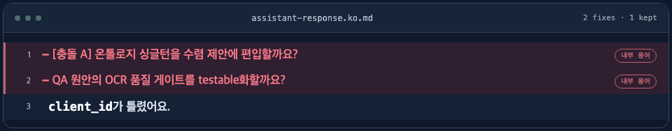

<!-- tone-lint: off (지양 예문을 담고 있어 자기 검출 제외) -->

# Claude Code Skills

[English](README.md) | [한국어](README.ko.md) | [日本語](README.ja.md) | [简体中文](README.zh-CN.md)

[@seungboshim](https://github.com/seungboshim)이 Claude Code에서 자주 쓰려고 만든 스킬 모음입니다.

<p align="center">
  <picture>
    <source media="(prefers-reduced-motion: reduce)" srcset="assets/korean-tone-hero/korean-tone-static.png">
    
  </picture>
</p>

<p align="center">
  <strong>Claude Code가 쓰는 한국어를 자연스럽게 다듬습니다.</strong><br>
  스킬은 문장을 다듬고, 린터는 놓친 번역투를 알려줍니다. 코드 식별자는 바꾸지 않습니다.
</p>

<p align="center"><code>/plugin install korean-tone@seungboshim-skills</code></p>

---

## ⭐ korean-tone: 문장은 다듬고 코드 좌표는 남깁니다

Claude Code와 오래 작업하다 보니, 틀린 한국어보다 맞지만 어색한 한국어를 더 자주 고치게
됐습니다. 그렇다고 문장을 다듬다가 `client_id` 같은 이름까지 바뀌면 실제 코드를 찾기
어렵습니다. korean-tone은 이 둘을 구분하려고 만든 스킬입니다.

계획·구현 설명, 리뷰, 체크리스트, 연구노트, 선택지의 딱딱한 번역투를 걷어내되 코드와
정확성은 그대로 둡니다.

### 이렇게 바뀝니다

**계획·구현 설명**

```diff
- 이 함수에 대해 리팩토링을 진행하겠습니다.
+ 이 함수를 리팩토링할게요.

- 캐싱을 통해 성능 향상을 도모할 수 있습니다.
+ 캐싱을 넣으면 성능이 올라가요.

- 입력값 검증이 수행되며, 수정이 이루어졌습니다.
+ 여기서 입력값을 검증했고, 문제도 고쳤어요.
```

**필요한 기술 용어는 남기고 뜻을 풀어 씁니다**

```diff
- handler가 stub이었다.
+ handler는 웹훅만 받고 저장하지 않았어요. 함수의 뼈대만 있고 실제 처리가 빠져 있었어요.

- client_id가 틀렸습니다.
+ client_id가 잘못됐어요. 인스타 전용 앱 ID가 들어갈 자리에 메타 앱 ID를 썼어요.
```

`client_id`는 그대로 남습니다. **저장소에서 다시 찾아야 할 이름(함수·파일·필드·커밋)은
좌표이므로 바꾸지 않습니다.** 이를 "고객 식별자"로 옮기면 사용자가 실제 코드를 찾기
어려워집니다.

**내부 작업 용어는 답변에서 걷어냅니다**

```diff
- [충돌 A] OCR 품질 게이트를 어떻게 처리할까요?
-   (현재: 'acceptable verbatim quality' — 측정 불가 지적)
+ AI가 손글씨를 잘 읽는지 언제 확인할까요?

- 온톨로지를 어떻게 고칠까요? (QA: auth_provider 누락 지적)
+ 데이터 구조를 정리할까요?
```

`AC7`, `이터레이션`, `수렴 제안` 같은 말은 Claude가 작업을 관리하려고 쓰는 표현입니다.
사용자의 결정에 필요하지 않다면 답변에 드러내지 않습니다.

### 스킬과 린터가 함께 작동합니다

스타일 규칙만으로는 모델이 놓친 표현을 모두 잡기 어렵습니다. korean-tone은 작성 규칙과
자동 린터를 함께 제공합니다.

| 구성 | 역할 | 작동 방식 |
|---|---|---|
| **작성 규칙(스킬)** | 문장을 쓰는 기준을 정합니다 | 한국어 답변과 문서에 규칙을 적용합니다 |
| **자동 점검(`tone-linter` 훅)** | 놓친 표현을 알려줍니다 | 한국어 `.md`를 저장할 때 번역투를 검사합니다 |

린터 규칙은 국립국어원의 번역투 연구, 토스 테크니컬 라이팅 가이드, 이오덕의
『우리글 바로쓰기』를 참고해 정리했습니다. 비교적 기계적으로 판별할 수 있는 규칙은
`error`(`~에 의해`, 이중 피동, `~에 있어서`, `그녀`)로, 문맥과 빈도를 함께 봐야 하는 규칙은
`warn`(`~를 통해`, `것이다`, 메타 담화)으로 나눕니다. 코드 블록, 인라인 코드, URL은 검사하지
않으며, 파일에 `<!-- tone-lint: off -->`를 넣으면 해당 파일을 건너뜁니다.

린터는 파일 저장을 막지 않습니다. 저장이 끝난 뒤 다듬을 표현만 알려줍니다.

### 말투 교정 결과도 반복해서 확인합니다

평가는 자동 검사와 사람 검수로 나눕니다. 자동 검사는 `client_id` 같은 코드 좌표와 핵심
사실, 문서 구조가 보존됐는지 확인합니다. 자연스러움, 정확성, 말투 일치, 과교정 여부는
사람이 1~5점으로 평가합니다. 일반 한국어 데이터셋도 참고할 수 있지만, 실제 작업에서 모은
교정 전후 예시가 이 스킬의 말투를 판단하는 기준이 됩니다.

저장소에는 스킬 호출 여부를 확인하는 질의 10개와 교정 품질 사례 12개가 들어 있습니다.
자동 채점기와 사람 검수표 생성기도 함께 들어 있어, 규칙을 바꾼 뒤 같은 사례로 다시
확인합니다.

### 이런 곳에 적용합니다

CLI에서 계획·구현·리뷰를 설명할 때 적용합니다. 문서를 쓸 때는 문서 형식에 맞는 규칙을
추가로 사용합니다.

- **체크리스트·백로그**에서는 여러 개념을 한 줄에 몰아넣지 않고 나눠 씁니다.
- **설계 결정 기록(ADR)·연구노트**에는 담백한 `~다` 문어체와 표준 ADR 구조를 적용합니다.
- **선택지**에는 결정할 내용과 각 선택이 사용자에게 미치는 결과만 담습니다.

---

## 나머지 스킬

### shimmy-tone

개발 블로그나 벨로그 글을 개인적인 말투로 씁니다. 일상적인 비유, 눈길을 끄는 제목과 반전,
밈과 이모지를 활용해 어려운 개념을 쉽게 설명합니다. korean-tone의 기본 교정 규칙은
유지하면서 이모지 제한만 완화합니다.

### feature-flow

화면이나 기능 하나를 범위 정리부터 문서화까지 이어서 작업할 수 있도록 안내합니다.

- 범위 정리, 계획, 실행, 리뷰, 커밋, 문서화의 9단계로 진행합니다.
- 단계가 바뀔 때마다 사용자에게 진행 여부를 확인합니다.
- 실행 중에는 Karpathy의 4원칙(Think / Simple / Surgical / Goal-driven)을 기준으로 스스로 점검합니다.
- 프로젝트의 기존 문서 구조와 규칙을 먼저 찾아 그에 맞춥니다.

### feature-flow-superpowers

feature-flow에 [superpowers](https://github.com/obra/superpowers)를 연동한 버전입니다. 각 단계에
맞는 superpowers 스킬을 호출합니다.

- 사용하려면 superpowers 플러그인이 필요합니다.
- `superpowers:test-driven-development`로 테스트 주도 개발을 진행합니다.
- `superpowers:verification-before-completion`으로 결과를 확인한 뒤 작업을 마칩니다.
- 단순한 구현을 선호하는 원칙과 TDD가 부딪힐 때 적용할 기준도 정해 두었습니다.

### daily

백로그, 최근 패치노트, Git 상태를 읽고 현재 작업 위치와 다음 우선순위를 정리합니다.

- 파일은 수정하지 않고 작업 현황과 추천만 보여줍니다.
- 프로젝트마다 다른 백로그와 패치노트 규칙을 먼저 찾습니다.
- feature-flow를 시작하기 전에 무엇부터 할지 고를 때 유용합니다.

### worklog

작업을 마친 뒤 패치노트, 기능 명세, 백로그를 한 번에 정리합니다.

- 다른 작업 흐름에 묶이지 않아, 어떤 작업을 마친 뒤에도 단독으로 호출합니다.
- 동작이 바뀌었다면 기능 명세도 함께 갱신합니다.
- 프로젝트의 기존 문서 규칙을 찾아 그 형식에 맞춥니다.

### tailwind-design-system

Tailwind CSS와 Next.js 프로젝트에서 디자인 시스템을 만들거나 다듬을 때 사용합니다.

- 디자인 방향 설정, 스타일 점검, 시맨틱 토큰 정의, 공용 컴포넌트 추출, 마이그레이션을 안내합니다.
- 새 프로젝트와 기존 프로젝트를 모두 지원합니다.
- 디자인 토큰을 제대로 쓰고 있는지 계속 점검합니다.

---

## 설치

### Claude Code 플러그인 경유 (권장)

```bash
/plugin marketplace add seungboshim/skills
/plugin install korean-tone@seungboshim-skills
```

플러그인으로 설치하면 korean-tone의 훅도 자동으로 등록됩니다.

원하는 스킬만 골라 설치하세요.

```bash
/plugin install shimmy-tone@seungboshim-skills
/plugin install feature-flow@seungboshim-skills
/plugin install feature-flow-superpowers@seungboshim-skills
/plugin install daily@seungboshim-skills
/plugin install worklog@seungboshim-skills
/plugin install tailwind-design-system@seungboshim-skills
```

### skills.sh로 설치하기 (여러 에이전트에서 사용)

```bash
npx skills add seungboshim/skills
```

다른 에이전트에서 쓰려면 `npx skills`로 설치하세요. 다만 korean-tone의 훅은
[따로 등록](skills/korean-tone/hooks/README.md)해야 합니다.

## 라이선스

MIT
